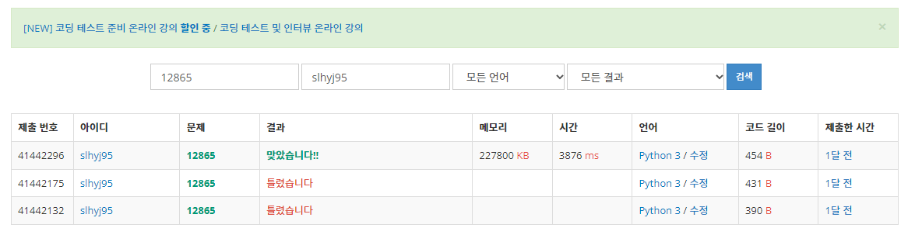

📣 학습한 내용을 정리한 글입니다.  
 
**Baekjoon** 12865번 문제입니다. 문제에 대한 내용과 풀이 그리고 결과를 간단하게 작성하였으니 참고바랍니다.  
풀이 언어 : Python
{: .notice--warning}

# 문제 설명

---

 
<b><u>내용</u></b>

이 문제는 아주 평범한 배낭에 관한 문제이다.  
한 달 후면 국가의 부름을 받게 되는 준서는 여행을 가려고 한다. 세상과의 단절을 슬퍼하며 최대한 즐기기 위한 여행이기 때문에, 가지고 다닐 배낭 또한 최대한 가치 있게 싸려고 한다.  
준서가 여행에 필요하다고 생각하는 N개의 물건이 있다. 각 물건은 무게 W와 가치 V를 가지는데, 해당 물건을 배낭에 넣어서 가면 준서가 V만큼 즐길 수 있다.  
아직 행군을 해본 적이 없는 준서는 최대 K만큼의 무게만을 넣을 수 있는 배낭만 들고 다닐 수 있다.  
준서가 최대한 즐거운 여행을 하기 위해 배낭에 넣을 수 있는 물건들의 가치의 최댓값을 알려주자.

 
<b><u>입력</u></b>

첫 줄에 물품의 수 N(1 ≤ N ≤ 100)과 준서가 버틸 수 있는 무게 K(1 ≤ K ≤ 100,000)가 주어진다.  
두 번째 줄부터 N개의 줄에 거쳐 각 물건의 무게 W(1 ≤ W ≤ 100,000)와 해당 물건의 가치 V(0 ≤ V ≤ 1,000)가 주어진다.  
입력으로 주어지는 모든 수는 정수이다.

 
<b><u>출력</u></b>

한 줄에 배낭에 넣을 수 있는 물건들의 가치합의 최댓값을 출력한다.

 
 

# 문제 풀이

---

**Dynamic Programming Algorithm 참고내용**
- 작성 중  

위 참고사항을 준수하며, 풀어보자. 
먼저, 다이나믹 프로그래밍 알고리즘을 생각해보자. dp table을 이용해서 V에 대한 2차원 배열을 고려해보면 해답을 구할 수 있다.  
dp table의 행과 열은 각각 N과 K가 되겠고 최대의 가치를 보존하는 무게와 그에 따른 짐의 개수를 변수로 생각하고 점화식을 구하면 된다.  
`dp[넣을 수 있는 짐의 개수][최종 짐의 무게] = 현재 행과 열의 index 값에 따른 넣을 수 있는 짐의 최대 가치`  
즉, 현재의 짐 w가 for문으로 반복되어 진행되고 있는 최종 짐의 무게(1<= j <= K)값보다 작을 때는 짐의 개수가 1개 적은 가치값이 최적의 값이 되는 것이고,  
반대로 현재의 짐 w가 더 크다면 `dp[i][j] = max(dp[i-1][j], dp[i-1][j-w] + v)`의 점화식으로 판별하면 된다.
 
 

# 작성 코드

---

## Python

 
 

# 작성 결과

---

{: .align-center}
